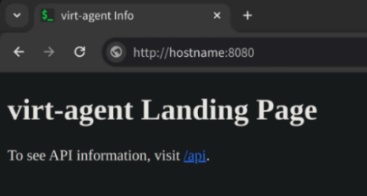
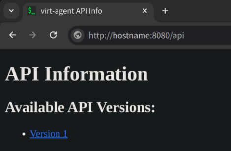
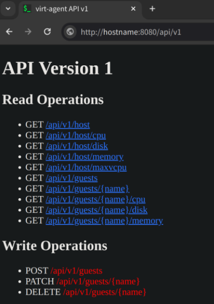

# virt-agent
```
.
├── client.py
├── create-vm.sh
├── guests.py
├── host.py
├── pages
│   ├── api.html
│   ├── apiv1.html
│   └── landing.html
├── preseed-template.cfg
├── README.md
├── requirements.txt
├── resources
│   ├── api_page.png
│   ├── apiv1_page.png
│   ├── favicon.ico
│   └── landing_page.png
└── server.py

```
This program serves as a management agent designed for physical machines equipped running the `libvirt`+`QEMU`+`KVM` stack. The agent exposes an HTTP server to which can be sent API requests to create/describe/update/delete VMs as well as get information about the physical hot itself. This allows for the remote management of VMs on the physical host. 

# Installation
1) Ensure the physical host is running Linux and has `libvirt`, `QEMU`, and `KVM` installed.
2) `git clone` or otherwise download this repository onto the physical host. 
3) Start the `virt-agent` HTTP server on the physical host by running `./server.py`.

# Usage
## Starting `virt-agent`
The `virt-agent` API server can be started on the physical host by running `./server.py`. The `--hostname` or `-h` option can be used to specify the interface to listen on. The default value is `localhost`. The `--port` or `-p` option can be used to specify the port that the API server will listen on. The default value is `8080`. 
```
# Starting the virt-agent API server on the physical host
$ ./server.py
virt-agent started on http://localhost:8080
```

The API can be called by sending HTTP requests to the port that `server.py` is listening on. 

## Read Operations
## Server Info
Sending a `GET` request to the root path returns information about the API server, as displayed by the `landing.html` page. This can be viewed in browser for clarity.



### API Documentation
Information about the API can be found by sending a `GET` request to the `/api` path.



Information about the available endpoints for API v1 can be found by sending a `GET` request to the `/api/v1` path.



### Host Information
Information about the physical host can be found by sending `GET` request to the `/api/v1/host*` paths. 

The `/api/v1/host/cpu` path returns information about the total and available number of CPU cores on the host.
```
$ curl http://hostname:8080/api/v1/host/cpu
{
    "total": 8,
    "available": 8
}
```

The `/api/v1/host/disk` path returns information about total, used, and free disk space on the host.
```
$ curl http://hostname:8080/api/v1/host/disk
{
    "filesystem": "/dev/nvme0n1",
    "size": "149G",
    "used": "111G",
    "available": "32G",
    "usePercentage": "78%",
    "mountPoint": "/"
}
```

The `/api/v1/host/memory` path returns information about the total, used, and free memory in KiB on the host.
```
$ curl http://hostname:8080/api/v1/host/memory
{
    "total": "15960040Ki",
    "used": "3510372Ki",
    "free": "1855320Ki",
    "shared": "1528772Ki",
    "buff/cache": "10594348Ki",
    "available": "10579828Ki"
}
```

The `/api/v1/host/maxvcpu` path returns the max possible number of vCPUs that can be assigned to any single VM on the host.
```
$ curl http://hostname:8080/api/v1/host/maxvcpu
{
    "maxvCPU": 16
}
```

The `/api/v1/host` path returns all of the above information in one JSON.
```
$ curl http://hostname:8080/api/v1/host
{
    "cpu": {
        "total": 8,
        "available": 8
    },
    "disk": {
        "filesystem": "/dev/nvme0n1",
        "size": "149G",
        "used": "111G",
        "available": "32G",
        "usePercentage": "78%",
        "mountPoint": "/"
    },
    "memory": {
        "total": "15960040Ki",
        "used": "3523152Ki",
        "free": "1834096Ki",
        "shared": "1536524Ki",
        "buff/cache": "10602792Ki",
        "available": "10559364Ki"
    },
    "maxVCPU": 16
}
```

## Write Operations
### Creating a VM
A VM can be created on the host by sending a `POST` request with a JSON containing the necessary parameters to the `/api/v1/guests` path. 
```
$ cat <<-"EOF" >> parameters.json
{
    "name": "debian1", 
    "cpu": 2, 
    "memory": 2048, 
    "diskSize": 20,
    "network": "bridge=br0", 
    "osVersion": "debian12",
    "diskImage": "https://deb.debian.org/debian/dists/bookworm/main/installer-amd64/", 
    "hostName": "debian1", 
    "domainName": "debian1.example.com",
    "fullName": "debian-user", 
    "username": "debian-user"
}
EOF

$ curl -X POST -H "Content-Type: application/json" -d @parameters.json http://hostname:8080/api/v1/guests
```

If the creation of the VM was successful, a message will be returned indicating that the VM was successfully created. The message will include the VM's host and domain name, Linux username, and password:
```
b'[2024-01-06T12:06:20-08:00][./create-vm.sh] VM debian1 successfully created!\n[2024-01-06T12:06:20-08:00][./create-vm.sh] VM name: debian1\n[2024-01-06T12:06:20-08:00][./create-vm.sh] VM host name: debian1\n[2024-01-06T12:06:20-08:00][./create-vm.sh] VM domain name: debian1.example.com\n[2024-01-06T12:06:20-08:00][./create-vm.sh] Debian username: debian-user\n[2024-01-06T12:06:20-08:00][./create-vm.sh] Debian password: xxxxxxxx\n[2024-01-06T12:06:20-08:00][./create-vm.sh] Use virsh or virt-manager for more information.\n'
```

For information on what parameters to pass in the request, see the [documentation](https://github.com/sabiq-khan/create-vm/tree/master) for the `create-vm` script. 
